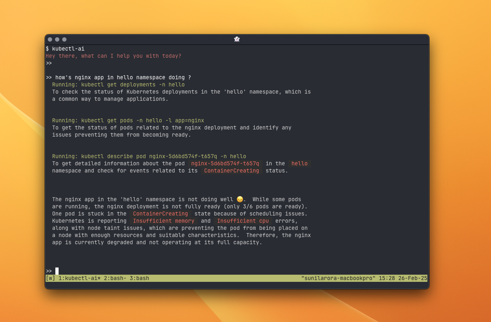

# kubectl-ai

## Overview

kubectl-ai is a kubernetes assistant that enhances the Kubernetes command-line experience using AI capabilities. It leverages Large Language Models (LLMs) such as Gemini to help users interact with Kubernetes clusters more efficiently.



## Installation

### Prerequisites

- Go 1.23 or later
- kubectl installed and configured
- Access to an Gemini API (other supported model)

### Install from Source

```bash
# Clone the repository
git clone https://github.com/GoogleCloudPlatform/kubectl-ai.git
cd kubectl-ai

# Build and install
go install .
```

### Environment Setup

Set up Gemini API key as follows:

```bash
export GEMINI_API_KEY=your_api_key_here
```

Get your API key from [Google AI Studio](https://aistudio.google.com) if you don't have one.

## Usage

Once installed, you can use kubectl-ai in two ways:

### Command Line Query

Simply provide your query as a positional argument:

```bash
kubectl-ai "your natural language query"
```

### Interactive Shell

If you run kubectl-ai without providing a query, it launches an interactive chat-like shell:

```bash
kubectl-ai
```

This interactive mode allows you to have a conversation with the AI assistant, asking multiple questions in sequence while maintaining context from previous interactions. Simply type your queries and press Enter to receive responses. To exit the interactive shell, type `exit` or press Ctrl+C.

### Examples

```bash
# Get information about pods in the default namespace
kubectl-ai "show me all pods in the default namespace"

# Create a new deployment
kubectl-ai "create a deployment named nginx with 3 replicas using the nginx:latest image"

# Troubleshoot issues
kubectl-ai "double the capacity for the nginx app"
```

The `kubectl-ai` assistant will process your query, execute the appropriate kubectl commands, and provide you with the results and explanations.

Note: This is not an officially supported Google product. This project is not
eligible for the [Google Open Source Software Vulnerability Rewards
Program](https://bughunters.google.com/open-source-security).
